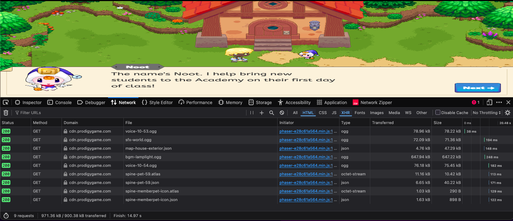
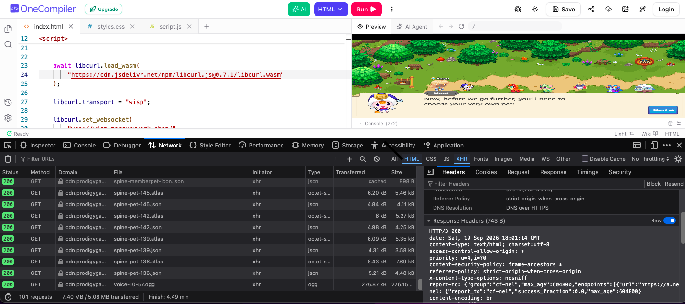

# **Quick Overview**
In this project, we are pulling game assets from another Github repository(bpog's) **but** standard network requests to it will be **blocked**.
So a clever solution to this is to use **[jsDelivr](https://www.jsdelivr.com/)** because jsDelivr is a Content Delivery Network that is trusted by many, which it is likely not to be blocked.
# Network Side(skip if you want)

  
This shows the **[XHR](https://nhimg.org/glossary/xhr-requests/)** requests sent to Prodigy's CDN when we interact with the game.
## More About This
If a network admin were to block XHR requests to a website(*which they and [filters](src/assets/securly.png) do lol*), the website assets will not load **but** since we used **[libcurl.js](https://github.com/ading2210/libcurl.js)** *it bypasses the network blocks.*

This shows the XHR requests when libcurl.js is used.

## What about Curlv3?
Curlv3 proxies traffic to my subdomain(which in turns proxies another website that hosts the multiplayer version of the game.) Crazy right?

### more info
It also still sends XHR requests to prodigy’s CDN and jsDelivr(as shown in the image below)

